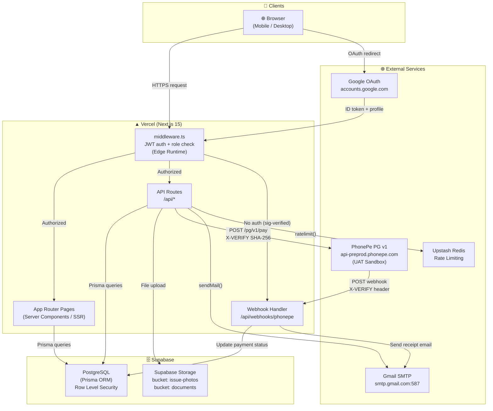
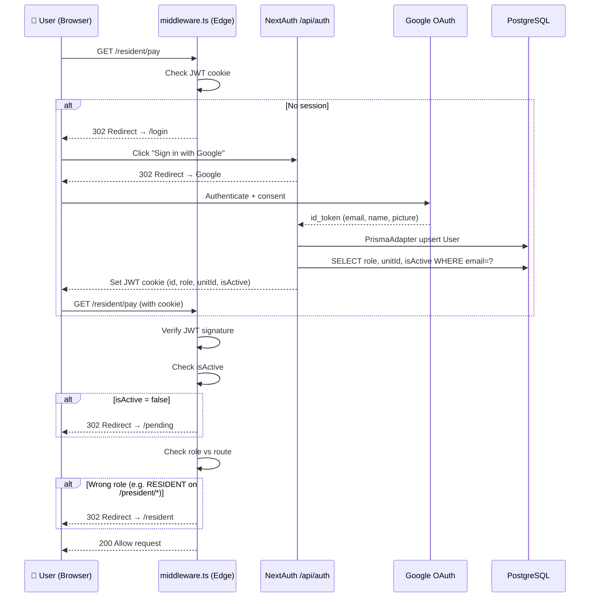
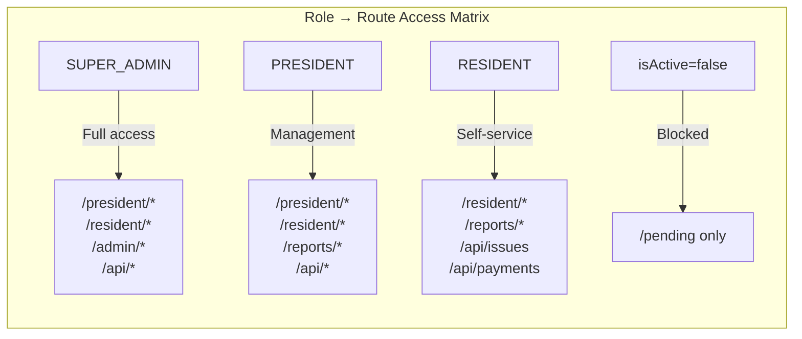
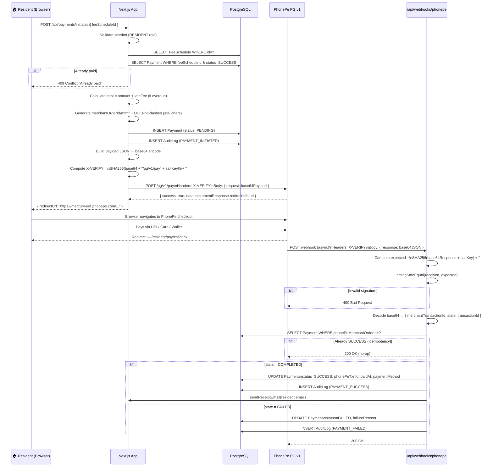
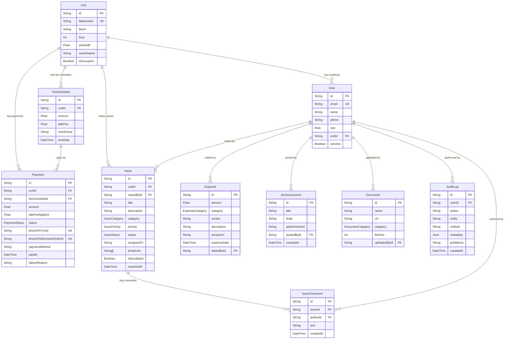
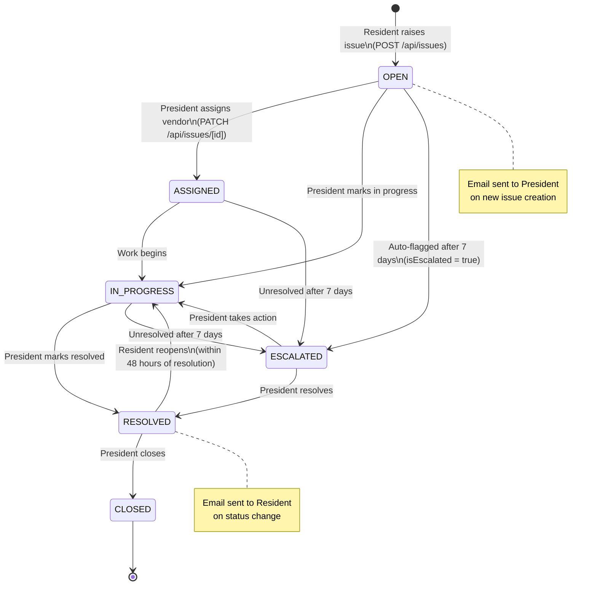
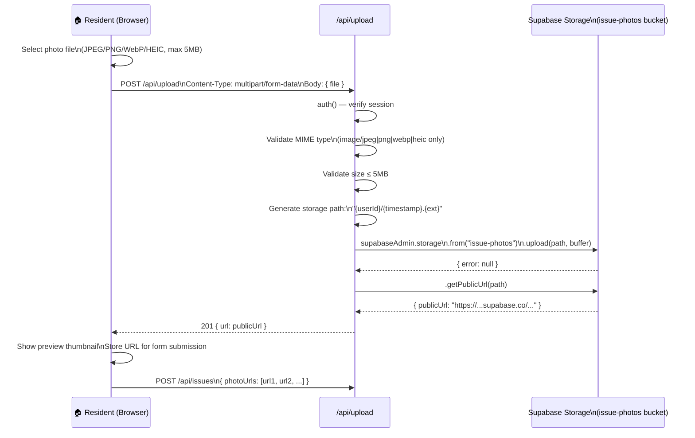
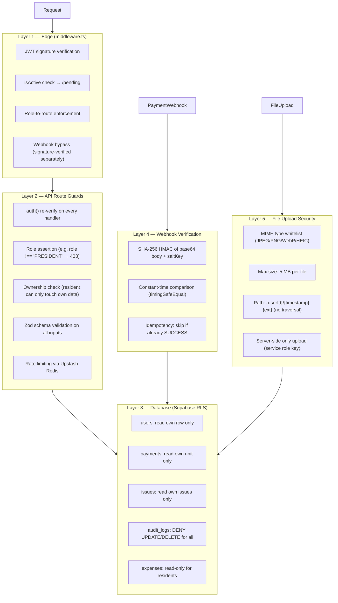

# Architecture

## Tech Stack

| Layer | Technology | Version | Rationale |
|-------|-----------|---------|-----------|
| Framework | Next.js | 15.x (App Router) | Full-stack SSR, API routes, middleware, free Vercel hosting |
| Language | TypeScript | 5.x | Type safety across frontend and backend |
| Database | PostgreSQL (Supabase) | Latest | Free 500 MB tier, built-in RLS, managed backups |
| ORM | Prisma | 5.x | Type-safe queries, migration management, SQL injection prevention |
| Auth | NextAuth.js | v5 | Google OAuth, JWT sessions, CSRF protection |
| UI Components | shadcn/ui + Tailwind CSS | Latest | Accessible Radix UI base, utility-first styling |
| File Storage | Supabase Storage | — | Free 1 GB, same platform as DB, S3-compatible |
| Email | Nodemailer + Gmail SMTP | — | Free, reliable for low volume (12-unit scale) |
| Payments | PhonePe PG v1 | — | Widest UPI adoption in India, SHA-256 X-VERIFY signature |
| Input Validation | Zod | 4.x | Schema validation on all API inputs |
| Rate Limiting | Upstash Redis | — | 10,000 req/day free tier, serverless-friendly |
| Hosting | Vercel | — | Free tier, zero-ops, auto-deploys from GitHub |

---

## 1. System Deployment Topology



---

## 2. Application Layer Architecture

```mermaid
graph TB
    subgraph NextApp["Next.js 15 App Router"]
        subgraph Layouts["Layouts"]
            RootLayout["app/layout.tsx\nRoot Layout\n(SessionProvider)"]
            DashLayout["app/(dashboard)/layout.tsx\nDashboard Layout\n(Sidebar + Header)"]
        end

        subgraph PresidentPages["🏛️ President Pages"]
            PDash["president/page.tsx\nDashboard (stats)"]
            PUnits["president/units/\nUnit management"]
            PUsers["president/users/\nResident management"]
            PFees["president/fees/\nFee schedules + dues"]
            PExpenses["president/expenses/\nExpense recording"]
            PIssues["president/issues/\nAll issues + detail"]
            PAnnounce["president/announcements/\nPost notices"]
            PDocs["president/documents/\nDocument vault"]
            PReports["president/reports/\nFinancial analytics"]
        end

        subgraph ResidentPages["🏠 Resident Pages"]
            RDash["resident/page.tsx\nDashboard (my status)"]
            RPay["resident/pay/\nPay fees + history"]
            RCallback["resident/pay/callback/\nPost-payment landing"]
            RIssues["resident/issues/\nMy issues + raise new"]
            RAnnounce["resident/announcements/\nView notices"]
            RDocs["resident/documents/\nView documents"]
            RReports["reports/\nPublic financial reports"]
        end

        subgraph APIRoutes["⚙️ API Routes"]
            AuthAPI["api/auth/[...nextauth]\nGoogle OAuth handler"]
            UsersAPI["api/users/[id]\nUser CRUD"]
            UnitsAPI["api/units/[id]\nUnit CRUD"]
            FeesAPI["api/fees/[id]\nFee schedule CRUD"]
            PayAPI["api/payments/initiate\nCreate PhonePe order"]
            PayHistory["api/payments/history\nPayment records"]
            WebhookAPI["api/webhooks/phonepe\nPayment callback"]
            IssuesAPI["api/issues/[id]\nIssue CRUD + status"]
            CommentsAPI["api/issues/[id]/comments\nThread comments"]
            ExpensesAPI["api/expenses/[id]\nExpense CRUD"]
            AnnounceAPI["api/announcements/[id]\nAnnouncement CRUD"]
            DocsAPI["api/documents/[id]\nDocument CRUD"]
            UploadAPI["api/upload\nSupabase file upload"]
            ReportsAPI["api/reports/summary\napi/reports/collection\nAggregated data"]
        end

        subgraph LibLayer["📚 lib/ — Server Utilities"]
            AuthLib["lib/auth.ts\nNextAuth + Prisma adapter\nJWT callbacks"]
            AuthConfig["lib/auth.config.ts\nEdge-safe config\n(for middleware)"]
            PrismaLib["lib/prisma.ts\nSingleton Prisma client"]
            PhonePeLib["lib/phonepe.ts\nX-VERIFY SHA-256\nPay / Status / Refund"]
            SupabaseLib["lib/supabase.ts\nService-role admin client\nStorage operations"]
            EmailLib["lib/email.ts\nNodemailer templates\nReceipt / Announcement / Status"]
            AuditLib["lib/audit.ts\nwriteAuditLog() helper"]
            RedisLib["lib/redis.ts\nUpstash rate limiter"]
        end

        subgraph Components["🧩 components/"]
            UIComp["ui/\nButton, Badge, Input\n(shadcn/ui)"]
            Sidebar["sidebar.tsx\nRole-aware nav links"]
            FeeMgr["fees/fee-manager.tsx\nGenerate fees modal"]
            IssueMgr["issues/issue-manage.tsx\nStatus + assignment panel"]
            CommentFm["issues/comment-form.tsx\nAdd comment (client)"]
            PayBtn["pay/pay-now-button.tsx\nInitiate payment (client)"]
        end
    end

    RootLayout --> DashLayout
    DashLayout --> PresidentPages
    DashLayout --> ResidentPages
    PresidentPages --> APIRoutes
    ResidentPages --> APIRoutes
    APIRoutes --> LibLayer
    PresidentPages --> Components
    ResidentPages --> Components
```



---

## 3. Authentication & Authorization Flow





---

## 4. Payment Flow (PhonePe v1)



---

## 5. Database Entity Relationship Diagram



---

## 6. Issue Lifecycle



---

## 7. Request Lifecycle (Middleware → API → DB)

```mermaid
flowchart TD
    A["Incoming HTTP Request"] --> B["middleware.ts\n(Edge Runtime)"]

    B --> C{Public route?\n/login, /api/auth,\n/api/webhooks/phonepe}
    C -->|Yes| D["Pass through\nNextResponse.next()"]
    C -->|No| E{Valid JWT\ncookie?}

    E -->|No| F["302 → /login"]
    E -->|Yes| G{isActive?}

    G -->|false| H["302 → /pending"]
    G -->|true| I{Role check\nvs pathname}

    I -->|Wrong role| J["302 → /resident or /login"]
    I -->|OK| K["Route Handler\n(API or Page)"]

    K --> L["auth() — re-verify\nsession server-side"]
    L --> M{Session\nvalid?}
    M -->|No| N["401 Unauthorized"]
    M -->|Yes| O["Zod schema\nvalidation"]

    O --> P{Valid\ninput?}
    P -->|No| Q["400 Bad Request\n{ error: ZodError }"]
    P -->|Yes| R{Rate limit\ncheck (Redis)}

    R -->|Exceeded| S["429 Too Many Requests"]
    R -->|OK| T["Prisma DB query\nvia DATABASE_URL"]

    T --> U{DB\nsuccess?}
    U -->|Error| V["500 Internal Server Error\n(JSON body)"]
    U -->|OK| W["Audit log write\n(financial actions only)"]
    W --> X["200 / 201 JSON Response"]
```

---

## 8. File Upload Flow (Issue Photos)



---

## 9. Folder Structure (Actual)

```
/
├── app/
│   ├── (auth)/
│   │   └── login/page.tsx                  # Google sign-in page
│   ├── (dashboard)/
│   │   ├── layout.tsx                      # Sidebar + header wrapper
│   │   ├── president/
│   │   │   ├── page.tsx                    # Dashboard: open issues, fee stats
│   │   │   ├── units/page.tsx              # 12 units grid + edit modal
│   │   │   ├── users/page.tsx              # Resident list + role/unit assignment
│   │   │   ├── fees/
│   │   │   │   ├── page.tsx                # Fee overview + month picker
│   │   │   │   └── fee-manager.tsx         # Generate fees modal (client)
│   │   │   ├── expenses/
│   │   │   │   ├── page.tsx                # Expense list + filters
│   │   │   │   └── expense-manager.tsx     # Add/edit expense (client)
│   │   │   ├── issues/
│   │   │   │   ├── page.tsx                # All issues + filters
│   │   │   │   ├── issue-filters.tsx       # Status/category filter (client)
│   │   │   │   └── [id]/
│   │   │   │       ├── page.tsx            # Issue detail + comments
│   │   │   │       ├── issue-manage.tsx    # Status/assignment panel (client)
│   │   │   │       └── comment-form.tsx    # Add comment (client)
│   │   │   ├── announcements/
│   │   │   │   ├── page.tsx
│   │   │   │   └── announcement-manager.tsx
│   │   │   ├── documents/
│   │   │   │   ├── page.tsx
│   │   │   │   └── document-manager.tsx
│   │   │   └── reports/page.tsx            # Charts + collection table
│   │   ├── resident/
│   │   │   ├── page.tsx                    # Dashboard: fee status, open issues
│   │   │   ├── pay/
│   │   │   │   ├── page.tsx                # Current fee card + payment history
│   │   │   │   ├── pay-now-button.tsx      # Initiate payment (client)
│   │   │   │   └── callback/page.tsx       # Post-payment landing (polling)
│   │   │   ├── issues/
│   │   │   │   ├── page.tsx                # My issues list
│   │   │   │   ├── new/page.tsx            # Raise issue form (3 photo slots)
│   │   │   │   └── [id]/
│   │   │   │       ├── page.tsx            # Issue detail + comments
│   │   │   │       └── comment-form.tsx
│   │   │   ├── announcements/page.tsx
│   │   │   └── documents/
│   │   │       ├── page.tsx
│   │   │       └── doc-filters.tsx
│   │   └── reports/
│   │       ├── page.tsx                    # Public financial summary
│   │       └── collection-table.tsx
│   ├── api/
│   │   ├── auth/[...nextauth]/route.ts     # NextAuth handler
│   │   ├── users/
│   │   │   ├── route.ts                    # GET all, POST create
│   │   │   └── [id]/route.ts               # PATCH, DELETE
│   │   ├── units/
│   │   │   ├── route.ts
│   │   │   └── [id]/route.ts
│   │   ├── fees/
│   │   │   ├── route.ts                    # GET + POST (generate for all units)
│   │   │   └── [id]/route.ts               # PATCH (edit amount/due date)
│   │   ├── payments/
│   │   │   ├── initiate/route.ts           # POST → PhonePe order
│   │   │   └── history/route.ts            # GET payment records
│   │   ├── webhooks/
│   │   │   └── phonepe/route.ts            # POST (signature-verified callback)
│   │   ├── issues/
│   │   │   ├── route.ts                    # GET (filtered) + POST
│   │   │   └── [id]/
│   │   │       ├── route.ts                # GET + PATCH (status/assign)
│   │   │       └── comments/route.ts       # POST comment
│   │   ├── expenses/
│   │   │   ├── route.ts
│   │   │   └── [id]/route.ts
│   │   ├── announcements/
│   │   │   ├── route.ts
│   │   │   └── [id]/route.ts
│   │   ├── documents/
│   │   │   ├── route.ts
│   │   │   └── [id]/route.ts
│   │   ├── upload/route.ts                 # POST multipart → Supabase Storage
│   │   └── reports/
│   │       ├── summary/route.ts            # Totals + by-category breakdown
│   │       └── collection/route.ts         # Per-unit monthly status
│   ├── layout.tsx                          # Root layout + SessionProvider
│   └── page.tsx                            # Redirect to /login or dashboard
├── components/
│   ├── ui/                                 # shadcn/ui: Button, Badge, Input, etc.
│   └── sidebar.tsx                         # Role-aware navigation links
├── lib/
│   ├── auth.ts                             # NextAuth + PrismaAdapter + JWT callbacks
│   ├── auth.config.ts                      # Edge-safe config (for middleware)
│   ├── prisma.ts                           # Prisma singleton (prevent hot-reload leaks)
│   ├── supabase.ts                         # Supabase service-role admin client
│   ├── phonepe.ts                          # PhonePe v1: pay, status, refund
│   ├── email.ts                            # Nodemailer: receipt, announcement, status
│   ├── audit.ts                            # writeAuditLog() helper
│   ├── redis.ts                            # Upstash rate limiter
│   └── utils.ts                            # Shared helpers (formatCurrency, etc.)
├── middleware.ts                           # Edge: JWT verify + role-based routing
├── prisma/
│   ├── schema.prisma                       # Full DB schema (10 models)
│   └── migrations/                         # Auto-generated SQL migrations
├── __tests__/
│   ├── api/                                # 20 API route test files (Vitest)
│   └── lib/                                # 4 lib utility test files
├── vitest.config.ts                        # Coverage thresholds: 90% lines/functions
├── vitest.setup.ts
└── .env.local                              # All secrets (git-ignored)
```

---

## 10. Security Layers



---

## 11. Environment Variables

```bash
# ── Database ──────────────────────────────────────────────
DATABASE_URL="postgresql://..."             # Supabase connection string

# ── Auth ──────────────────────────────────────────────────
NEXTAUTH_URL="http://localhost:3000"        # App base URL (localhost for dev)
NEXTAUTH_SECRET="..."                       # openssl rand -base64 32
GOOGLE_CLIENT_ID="..."                      # Google Cloud Console
GOOGLE_CLIENT_SECRET="..."

# ── PhonePe v1 (UAT) ──────────────────────────────────────
PHONEPE_MERCHANT_ID="PGTESTPAYUAT86"        # Public UAT merchant
PHONEPE_MERCHANT_KEY="96434309-..."         # Salt key for X-VERIFY
PHONEPE_KEY_INDEX="1"
PHONEPE_ENV="SANDBOX"                       # SANDBOX | PRODUCTION
NEXT_PUBLIC_APP_URL="https://tunnel.trycloudflare.com"  # Public URL for webhooks

# ── Supabase ──────────────────────────────────────────────
NEXT_PUBLIC_SUPABASE_URL="https://xxx.supabase.co"
NEXT_PUBLIC_SUPABASE_ANON_KEY="eyJ..."     # Safe to expose (RLS enforced)
SUPABASE_SERVICE_ROLE_KEY="eyJ..."         # Server-only — never in NEXT_PUBLIC_*

# ── Email ─────────────────────────────────────────────────
GMAIL_USER="president@gmail.com"
GMAIL_APP_PASSWORD="xxxx xxxx xxxx xxxx"   # Google App Password (not login password)

# ── Rate Limiting ─────────────────────────────────────────
UPSTASH_REDIS_REST_URL="https://..."
UPSTASH_REDIS_REST_TOKEN="..."
```
